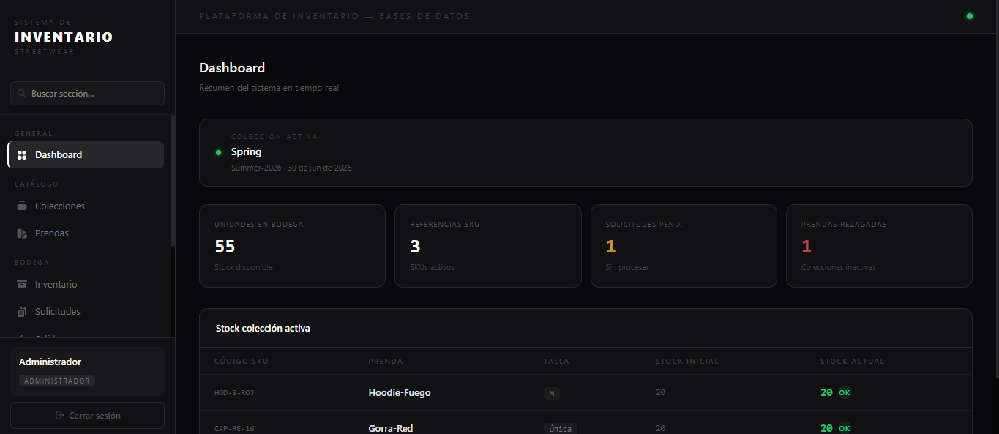

# Inventario Streetwear

Plataforma web de gestión de inventario para una tienda de ropa urbana (streetwear), desarrollada como proyecto final para la asignatura de Bases de Datos de la **Universidad Tecnológica de Pereira**. Permite administrar colecciones, prendas, stock, solicitudes a proveedores, salidas de bodega y generar reportes en tiempo real.



---

## ¿Qué problema soluciona?

Las tiendas de streetwear manejan múltiples colecciones, referencias (SKUs) por talla y movimientos constantes de mercancía. Sin un sistema centralizado, el control de inventario se vuelve caótico. Esta plataforma reemplaza el manejo manual en hojas de cálculo por un sistema web con roles de usuario, trazabilidad completa de movimientos y reportes automáticos.

---

## Stack tecnológico

### Base de datos
| Herramienta | Uso |
|---|---|
| **Supabase** (PostgreSQL) | Base de datos relacional en la nube con triggers, vistas y restricciones |

### Backend
| Herramienta | Uso |
|---|---|
| **Next.js 16 — API Routes** | Endpoints REST para cada módulo del sistema |
| **Supabase JS SDK** | Cliente para consultas y mutaciones desde el servidor |
| **Cookies + Middleware** | Autenticación por sesión y protección de rutas |

### Frontend
| Herramienta | Uso |
|---|---|
| **Next.js 16** (App Router) | Framework principal con renderizado híbrido |
| **React 19** | Componentes de interfaz con hooks |
| **TypeScript** | Tipado estático en todo el proyecto |
| **Tailwind CSS v4** | Sistema de estilos utilitarios |
| **shadcn/ui** | Componentes base (Button, Badge, Input, Skeleton) |
| **Lucide React + Heroicons** | Iconos SVG |
| **Sonner** | Notificaciones toast |

### Despliegue
| Herramienta | Uso |
|---|---|
| **Vercel** | Hosting con CI/CD automático desde GitHub |
| **GitHub** | Control de versiones y repositorio del proyecto |

---

## Funcionalidades principales

- **Autenticacion** — Login con email y contrasena, sesion por cookies, proteccion de rutas por middleware
- **Roles de usuario** — Administrador (acceso total) y Bodeguero (acceso restringido a inventario, salidas, aliados y reportes)
- **Colecciones** — Gestion de campanas. Solo puede haber una activa a la vez (controlado por trigger). No se pueden eliminar para proteger la trazabilidad
- **Prendas y SKUs** — Catalogo de referencias por talla. Las prendas y SKUs se crean automaticamente al registrar una solicitud de proveedor. Se pueden activar o desactivar, no eliminar
- **Inventario** — Vista en tiempo real del stock disponible con busqueda por nombre o SKU
- **Solicitudes a proveedor** — Creacion de pedidos con seguimiento de recepcion. Soporta llegadas parciales acumulativas. El stock se actualiza automaticamente via trigger al registrar cada recepcion
- **Salidas de bodega** — Registro de despachos hacia aliados multimarca con descuento automatico de stock via trigger y validacion de stock disponible
- **Aliados** — Directorio de tiendas multimarca con estado activo/inactivo
- **Reportes** — Stock activo (coleccion y prenda activas), prendas rezagadas, historial de salidas y estado de solicitudes
- **Dashboard** — Metricas clave del negocio en tiempo real
- **Usuarios** — Gestion de accesos exclusiva para administrador: crear, activar/desactivar y cambiar roles

---

## Estructura del proyecto

```
src/
├── app/
│   ├── api/                    # Endpoints REST del servidor
│   │   ├── auth/               # Login y logout
│   │   ├── colecciones/        # CRUD colecciones
│   │   ├── prendas/            # CRUD prendas (activar/desactivar)
│   │   ├── sku/                # SKUs con join a prenda
│   │   ├── solicitudes/        # CRUD solicitudes
│   │   ├── detalles/           # Items de solicitud (auto-crea prenda+SKU)
│   │   ├── salidas/            # Registro de despachos
│   │   ├── usuarios/           # CRUD usuarios
│   │   ├── clientes/           # CRUD aliados
│   │   ├── inventario/         # Vista consolidada de stock
│   │   ├── reportes/           # Datos de reportes
│   │   └── proveedores/        # CRUD proveedores
│   ├── page.tsx                # Dashboard (ruta: /)
│   ├── login/                  # Pagina de autenticacion
│   ├── colecciones/
│   ├── prendas/
│   ├── inventario/
│   ├── solicitudes/
│   ├── salidas/
│   ├── clientes/
│   ├── reportes/
│   └── usuarios/               # Solo visible para administrador
├── components/
│   ├── Sidebar.tsx             # Navegacion con filtro por rol
│   ├── LayoutShell.tsx
│   └── ui/                     # Componentes base (Button, Badge, etc.)
├── lib/
│   └── supabase/
│       ├── server.ts           # Cliente con service_role_key (solo servidor)
│       └── client.ts           # Cliente con anon_key (browser)
├── store/
│   └── useInventarioStore.ts   # Estado global con Zustand
└── middleware.ts               # Proteccion de rutas por sesion
```

---

## Base de datos

### Tablas
`usuario` - `coleccion` - `prenda` - `sku` - `proveedor` - `solicitud_proveedor` - `detalle_solicitud` - `salida_bodega` - `cliente`

### Vistas
| Vista | Descripcion |
|-------|-------------|
| `stock_actual` | SKUs con prenda, coleccion y estados — usada en reportes e inventario |
| `stock_actual_en_bodega` | Vista completa de todos los SKUs sin filtro de estado |
| `inventario_por_coleccion` | Resumen de unidades ingresadas, en bodega y salidas por coleccion |
| `prendas_aun_en_bodega` | Prendas de colecciones inactivas con stock mayor a cero |
| `prendas_rezagadas` | Version simplificada de prendas_aun_en_bodega |

### Triggers
| Trigger | Tabla | Evento | Funcion |
|---------|-------|--------|---------|
| `trigger_una_coleccion_activa` | coleccion | BEFORE INSERT/UPDATE | Garantiza que solo haya una coleccion activa a la vez |
| `trigger_validar_stock` | salida_bodega | BEFORE INSERT | Valida stock disponible y lo descuenta al registrar una salida |
| `trigger_estado_verificacion` | detalle_solicitud | BEFORE UPDATE | Actualiza stock, estado del item y estado de la solicitud al recibir mercancia |

---

## Variables de entorno

Crear un archivo `.env.local` en la raiz del proyecto con:

```env
NEXT_PUBLIC_SUPABASE_URL=https://tu-proyecto.supabase.co
NEXT_PUBLIC_SUPABASE_ANON_KEY=tu-anon-key
SUPABASE_SERVICE_ROLE_KEY=tu-service-role-key
```

> Estas variables nunca deben subirse al repositorio. El archivo `.env.local` esta incluido en `.gitignore`.

---

## Instalacion y ejecucion local

```bash
# Clonar el repositorio
git clone https://github.com/alejoramirez27/PaginaWeb-Inventario-TiendaRopa.git
cd PaginaWeb-Inventario-TiendaRopa

# Instalar dependencias
npm install

# Configurar variables de entorno
# Crear .env.local con las credenciales de Supabase

# Ejecutar en desarrollo
npm run dev
```

Abrir [http://localhost:3000](http://localhost:3000)

---

## Autor

**Alejandro Ramirez**
Estudiante de Ingenieria — Universidad Tecnologica de Pereira
GitHub: [@alejoramirez27](https://github.com/alejoramirez27)

---

> Proyecto academico — 2025
